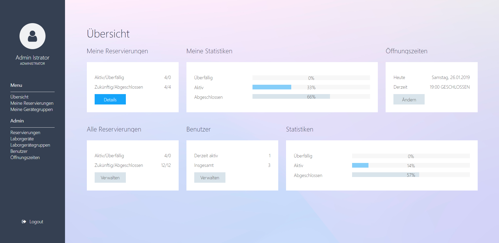

# EVS_GROUP2 Project

This projetc provides a reservation application for laboratory equipment.

<!-- TOC -->

- [EVS_GROUP2 Project](#evs_group2-project)
-   - [Usage](#usage)
    - [Notes](#notes)
        - [Code Conventions](#code-conventions)
        - [How to use the Git Cli](#how-to-use-the-git-cli)

<!-- /TOC -->

## Usage

To access the application, execute `mvn spring-boot:run` directly in the project folder and then connect to [http://localhost:8080/](http://localhost:8080/).

The following accounts are available:

| username | password | role |
|   ---   |    ---   |    ---     |
| `admin` | `passwd` | `ADMIN`    |
| `user1` | `passwd` | `EMPLOYEE` |
| `user2` | `passwd` | `STUDENT`  |

## Notes

### Code Conventions

- [Code Conventions](./code_conventions.pdf)

### How to use the Git Cli

- [How to set up a SSH-Key](https://docs.gitlab.com/ee/ssh/README.html)
- [Setup](https://docs.gitlab.com/ee/gitlab-basics/start-using-git.html)
- [Git Cheatsheet](./git_cheatsheet.pdf)
